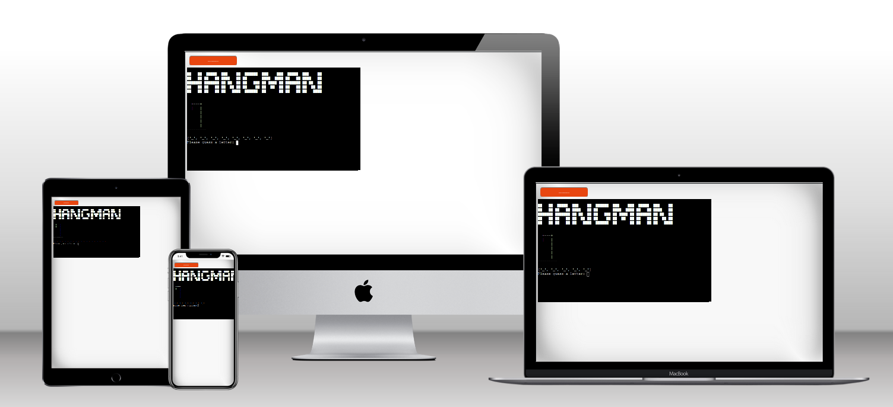
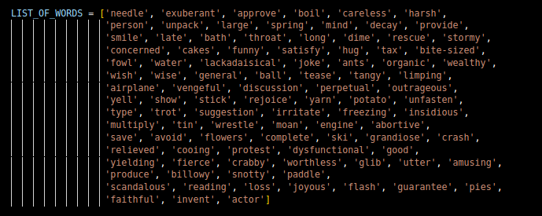
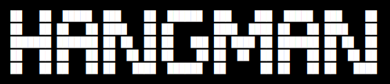
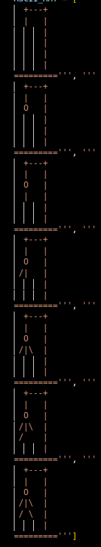
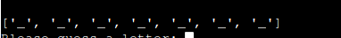
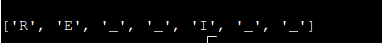
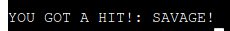

# HANGMAN

## How to play:

The classic game of hangman is a simple one. One has to guess a word by choosing letters that might be in the word. If the letter is in the word , then the letter/letters at their respective positions are revealed and the game continues, however if you guess a letter that is not in the word , there are consequences: a little man representing your "lives" in the game inches one step closer to his grim fate. The game continues until all the letters in the word are guessed, resulting in a victory, the other outcome is that the player runs out of lives, resulting in a loss . 

You can visit the live site on Heroku [here](https://hangman-jamie-simms-aab00bf1f5f3.herokuapp.com/) .

## Features

### Many words to guess from: 
I used an array with many different words of varying length to give the game a lot of room for replayability:

### ASCII LOGO:

The game features a nice little logo to go over the top of the screen:

It is made using ASCII art, which is a way of representing pictures using text and characters.

### ASCII Hangman Gallows

Using the same ASCII art that makes the logo for the game possible, I have arranged a little set of art works, saved into it's own array in the game files, that represent the various stages of the poor man that is about to be hung if the player is not successful. There are seven of these designs in total:

### Letter Display

I included a display to visually represent the word that the player is trying to guess. At first it appears as an array of empty underscores, one for each of the letters in the word that is being guessed. As the player begin to guess letters correctly , the underscores get replaced with the correctly guessed letters.-

#### Empty display:

#### Correct letters:

### Input and Validation:

Users are prompted to input a letter into the terminal , but there is input validation to ensure that the user does not:

- input an empty value
- input a number
- input any character that is not a letter of the alphabet
- input more than one letter

### Varying messages:

The message when the player gets a "hit" or "miss" are not static, they may be different.

#### Hit messages:

#### Miss messages:

### Continue screen:

Whether the player is victorious or ends up hanging their unfortunate companion, the player is presented with the choice whether or not they want to continue by way of a simple y/n input. This screen also has input validation to make sure that the player cannot break the game by inputting something other than a "y" or a "n".

### Future features:

In the future I would like to see the following features in addition to the ones that are already available: 

- A difficulty option (easy, medium, hard)
- A display for the letters that have been guessed already.

### Data model:

The code is object oriented and almost every aspect of the game is stored within an object simply called "Game". This objects stores the following data:

- The word to be guessed.
- The amount of "lives" that the player has left. 
- The letters and underscores in the display
- The letters that have already been guessed.

The game object also houses all of the functions that make the game possible such as:

- Clearing the screen. 
- Creating the word display.
- Refreshing the screen with up-to-date information.
- Displaying validation messages clearly
- Making a validating user guesses
- Checking those guesses to see if it is a hit or a miss
- Resetting the game and restoring default values
- ASking the player whether they would like to continue.
